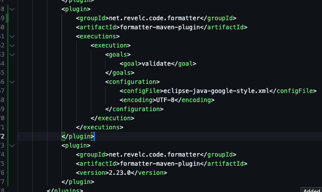

# MiniJava
Mini-Java is a subset of Java. MiniJava compiler implement a compiler for the Mini-java
programming language.

# Rules of MiniJava
```
Goal --> Source EOF
Source --> ClassDeclarations MainClass
MainClass --> class Identifier { public static void main() { VarDeclarations Statements}}
ClassDeclarations --> ClassDeclaration ClassDeclarations | lambda
ClassDeclaration --> class Identifier Extension { FieldDeclarations MethodDeclarations }
Extension --> extends Identifier | lambda
FieldDeclarations --> FieldDeclaration FieldDeclarations | lambda
FieldDeclaration --> static Type Identifier ;
VarDeclarations --> VarDeclaration VarDeclarations | lambda
VarDeclaration --> Type Identifier ;
MethodDeclarations --> MethodDeclaration MethodDeclarations | lambda
MethodDeclaration --> public static Type Identifier ( Parameters ) { VarDeclarations Statements return GenExpression ; }
Parameters --> Type Identifier Parameter | lambda
Parameter --> , Type Identifier Parameter | lambda
Type --> boolean | int
Statements --> Statements Statement | lambda
Statement --> { Statements } | if ( GenExpression ) Statement else Statement | while ( GenExpression ) Statement | System.out.println ( GenExpression ) ; | Identifier = GenExpression ;
GenExpression --> Expression | RelExpression
Expression --> Expression + Term | Expression - Term | Term
Term --> Term * Factor | Factor
Factor --> ( Expression ) | Identifier | Identifier . Identifier | Identifier . Identifier ( Arguments ) | true | false | Integer
RelExpression --> RelExpression && RelTerm | RelTerm
RelTerm --> Expression == Expression | Expression < Expression
Arguments --> GenExpression Argument | lambda
Argument --> , GenExpression Argument | lambda
Identifier --> <IDENTIFIER_LITERAL>
Integer --> <INTEGER_LITERAL>
```

## 1st Facade
از آنجا که کلاس Parser تنها از دو تابع CodeGenerator استفاده میکند، میتوان این دو تابع را بصورت یک واسط Facade به نام ParserCodeGeneratorFacade جدا کرد.
```java
package MiniJava.parser;

import MiniJava.codeGenerator.CodeGenerator;
import MiniJava.scanner.token.Token;

public class ParserCodeGeneratorFacade {
    private final CodeGenerator cg;

    public ParserCodeGeneratorFacade() {
        this.cg = new CodeGenerator();
    }

    public void semanticFunction(int func, Token next) {
        cg.semanticFunction(func, next);
    }

    public void printMemory() {
        cg.printMemory();
    }
}
```

## 2nd Facade
از آنجا که کلاس SymbolTable تنها از یک تابع Memory استفاده میکند، میتوان این تابع را بصورت یک واسط Facade به نام SymbolTableMemoryFacade جدا کرد.
```java
package MiniJava.semantic.symbol;

import MiniJava.codeGenerator.Memory;

public class SymbolTableMemoryFacade {
    private Memory mem;

    public SymbolTableMemoryFacade(Memory mem) {
        this.mem = mem;
    }

    public int getDateAddress() {
        return mem.getDateAddress();
    }
}
```

## Replace Conditional with Polymorphism
برای اعمال این بازآرایی تابع semanticAction در CodeGeneration را هدف قرار دادیم. این تابع با توجه به یک مقدار int func توابع مختلف تولید کد را صدا میزند. برای رفع این موضوع، ما یک واسط به نام SematicAction به صورت زیر تعریف کردیم.
```java
public interface SemanticAction {
    void execute(CodeGenerator cg, Token next);
}
```
سپس به ازای هر یک از توابع صدا شده در semanticAction یک کلاس تعریف کردیم که از SemanticAction ارث میبرد و تابع execute آن دارای محتویات جابجا شده از تابع موجود در کلاس CodeGeneration است. بعنوان مثال کلاس CheckIdSemanticAction بازآرایی شده‌ی checkId بصورت زیر است:
```java
class CheckIDSemanticAction implements SemanticAction {
    @Override
    public void execute(CodeGenerator cg, Token next) {
        Stack<String> symbolStack = cg.getSymbolStack();
        Stack<Address> ss = cg.getSs();

        symbolStack.pop();
        if (ss.peek().varType == varType.Non) {
            //TODO : error
        }
    }
}
```
سپس یک array حاوی SemanticActionهای مختلف در CodeGenerator قرار دادیم و مقادیر شماره‌ی تابع را به عنوان اندیس‌شان قرار دادیم. به صورت زیر:
```java
public class CodeGenerator {
    // other stuff

    private SemanticAction[] actionMap = new SemanticAction[34];

    public CodeGenerator() {
        symbolTable = new SymbolTable(memory);
        
        actionMap[0] = new ReturnSemanticAction();
        actionMap[1] = new CheckIDSemanticAction();
        actionMap[2] = new PidSemanticAction();
        actionMap[3] = new FpidSemanticAction();
        actionMap[4] = new KpidSemanticAction();
        // ...
        actionMap[29] = new MethodReturnSemanticAction();
        actionMap[30] = new DefParamSemanticAction();
        actionMap[31] = new LastTypeBoolSemanticAction();
        actionMap[32] = new LastTypeIntSemanticAction();
        actionMap[33] = new DefMainSemanticAction();
    }

    // more other stuff
}
```
در نهایت تابع semanticAction بصورت زیر شد:
```java
public void semanticFunction(int func, Token next) {
    Log.print("codegenerator : " + func);
    actionMap[func].execute(this, next);
}
```

## Seperate Query from Modifier
برای اعمال این بازآرایی تابع getTemp() در Memory را که هم عمل Modification انجام میداد و هم مقدار قبلی را باز میگرداند به دو تابع getTempIndex() و addTempIndex() تغییر میدهیم و هر جا از آن استفاده شده بود، با توابه جدید بروزرسانی میکنیم.

```java
public class Memory {
    // other stuff

    public int getTempIndex() {
        return lastTempIndex;
    }

    public void addTempIndex() {
        lastTempIndex += tempSize;
    }

    // more other stuff
}
```

## Self-Encapsulate Field
این موضوع در چندین کلاس رعایت نشده است. یکی از نمونه‌‌های آن در کلاس Memory است که متغیر private با نام codeBlock آن در داخل کلاس بصورت direct access استفاده شده‌ است که ما بصورت زیر این کلاس را تغییر دادیم.

```java
public class Memory {
    @Getter
    @Setter
    private ArrayList<_3AddressCode> codeBlock;
    private int lastTempIndex;
    private int lastDataAddress;
    private final int stratTempMemoryAddress = 500;
    private final int stratDataMemoryAddress = 200;
    private final int dataSize = 4;
    private final int tempSize = 4;

    public Memory() {
        setCodeBlock(new ArrayList<_3AddressCode>());
        lastTempIndex = stratTempMemoryAddress;
        lastDataAddress = stratDataMemoryAddress;
    }

    public int getTempIndex() {
        return lastTempIndex;
    }

    public void addTempIndex() {
        lastTempIndex += tempSize;
    }

    public int getDateAddress() {
        lastDataAddress += dataSize;
        return lastDataAddress - dataSize;
    }

    public int saveMemory() {
        getCodeBlock().add(new _3AddressCode());
        return getCodeBlock().size() - 1;
    }

    public void add3AddressCode(Operation op, Address opr1, Address opr2, Address opr3) {
        getCodeBlock().add(new _3AddressCode(op, opr1, opr2, opr3));
    }

    public void add3AddressCode(int i, Operation op, Address opr1, Address opr2, Address opr3) {
        getCodeBlock().remove(i);
        getCodeBlock().add(i, new _3AddressCode(op, opr1, opr2, opr3));
    }

    public int getCurrentCodeBlockAddress() {
        return getCodeBlock().size();
    }

    public void pintCodeBlock() {
        System.out.println("Code Block");
        for (int i = 0; i < getCodeBlock().size(); i++) {
            System.out.println(i + " : " + getCodeBlock().get(i).toString());
        }
    }
}
```

## Additional Refactoring 1: Encapsulate Collection
این تکنیک بازآرایی بدین معناست که داده-ساختارهای از نوع collection نباید تنها یک getter و setter ساده داشته باشند بلکه getter آنها باید یک کپی immutable برگرداند و همچنین بجای setter از توابع ریزدانه‌ای add و remove استفاده کنیم. ما این تکنیک را برای متغیر rules در کلاس Parser اعمال کردیم. (۴ تابع به این کلاس افزودیم و بجای دسترسی مستقیم به rules و تغییر محتویات آن، از این توابع استفاده کردیم.)
```java
public void clearRules() {
    this.rules = new ArrayList<Rule>();
}

public void addRule(Rule rule) {
    this.rules.add(rule);
}

public void removeRule(Rule rule) {
    this.rules.remove(rule);
}

public List<Rule> getRules() {
    return Collections.unmodifiableList(this.rules);
}
```

## Additional Refactoring 2: Replace Exception with Test
این تکنیک به این صورت است که برای افزایش خوانایی کد بجای استفاده از try/catch برای مقداردهی یک متغیر یا برگرداندن یک مقدار خاص، از if استفاده کنیم. ما برای این تکنیک، try/catch موجود در کلاس Rule را که عدد را از رشته استخراج میکند به ضکل زیر تبدیل کردیم.
```diff
- try {
-     semanticAction = Integer.parseInt(stringRule.substring(index + 1));
- } catch (NumberFormatException ex) {
-     semanticAction = 0;
- }
+ String actionPart = stringRule.substring(index + 1);
+ if (actionPart.matches("\\d+")) {
+     semanticAction = Integer.parseInt(actionPart);
+ } else {
+     semanticAction = 0;
+ }
```

## افرودن formatter
در قسمت plugins در فایل pom.xml پلاگگین‌‌ها را می‌افزاییم. حال هربار دستور mvn install را اجرا میکنیم این فایل با توجه به فایل eclipse-java-google-style.xml مرتب بودن فایل‌هایمان را بررسی میکند. اگر مقدار goal را format ثرار دهیم عمل formatting را هم انجام میدهد.
